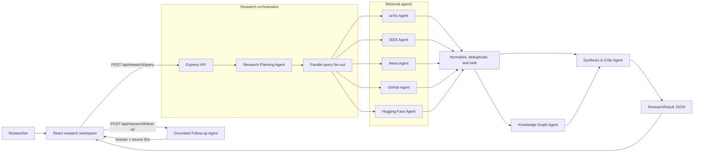
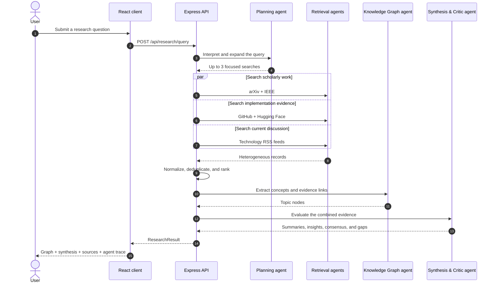

# MARA — Multi-Agent Research Intelligence Platform

<p align="center">
  <strong>Turn one research question into a traceable map of papers, news, repositories, models, concepts, and evidence-grounded insights.</strong>
</p>

<p align="center">
  
  
  
  
</p>
  
MARA is a full-stack research workspace that coordinates specialized agents to search multiple live sources in parallel, normalize and rank the evidence, extract evidence-backed concepts, synthesize findings, and answer follow-up questions from the retrieved documents.

The interface keeps the complete research trail visible: every concept can be opened in the interactive knowledge graph, every insight can be traced to its sources, and every follow-up answer includes the documents used.

> **Project status:** Active prototype. The main research workflow is functional; persistence is currently browser-local and the external providers remain subject to their own availability and rate limits.

## What MARA does

- Expands a broad question into focused search queries with an LLM-backed planning agent.
- Searches arXiv, IEEE Xplore, technology RSS feeds, GitHub, and Hugging Face concurrently.
- Converts heterogeneous results into one consistent evidence model.
- Deduplicates and ranks records using relevance and freshness signals.   
- Builds an interactive knowledge graph of concepts linked to supporting sources.
- Produces brief and extensive summaries, findings, consensus points, and evidence gaps.
- Shows an execution trace for each research, analysis, and synthesis agent.
- Supports follow-up questions grounded only in the retrieved evidence.
- Retains the ten most recent research sessions in browser `localStorage`.

## Product tour

### 1. Research workspace

Enter a question in natural language. MARA runs the research pipeline and returns the graph, synthesis, intelligence panels, and source explorer in one workspace.

<!-- SCREENSHOT: Add docs/images/research-workspace.png, then remove this comment and uncomment the line below. -->
<!--  -->

### 2. Interactive knowledge graph

The center node represents the research question. Concept nodes are extracted from the retrieved evidence, their size reflects supporting-source coverage, and selecting one filters the evidence explorer.

<!-- SCREENSHOT: Add docs/images/knowledge-graph.png, then remove this comment and uncomment the line below. -->
<!--  -->

### 3. Agent intelligence and grounded follow-ups

The intelligence view exposes agent status, evidence-backed findings, consensus, and gaps. Follow-up answers are restricted to the current result set—or to the selected concept's evidence—and display their citations.

<!-- SCREENSHOT: Add docs/images/agent-intelligence.png and docs/images/grounded-follow-up.png, then uncomment the lines below. -->
<!--  -->
<!--  -->

## Architecture

MARA separates presentation, orchestration, retrieval, analysis, and synthesis. The active frontend is `src/pages/ResearchExplorer.tsx`; the active API pipeline is mounted from `server/routes/research.ts`.



### Agent responsibilities

| Agent | Responsibility | Output |
| --- | --- | --- |
| Research Planning Agent | Interprets intent and expands the question into up to three focused searches | Topic and search terms |
| arXiv Agent | Retrieves recent and relevant preprints | Normalized papers |
| IEEE Agent | Retrieves IEEE Xplore records when an API key is configured | Normalized papers |
| News Agent | Searches configured technology RSS feeds | Normalized news items |
| GitHub Agent | Finds relevant, recently active repositories | Normalized repositories |
| Hugging Face Agent | Finds related public models | Normalized models |
| Knowledge Graph Agent | Extracts 8–14 meaningful concepts and connects each to evidence | Topic nodes and source IDs |
| Synthesis & Critic Agent | Produces summaries, insights, consensus, implications, and gaps | Research intelligence |
| Grounded Follow-up Agent | Answers from the supplied result set and returns supporting citations | Answer and citation IDs |

The planning, concept, synthesis, and follow-up stages have deterministic fallbacks. If the configured LLM is unavailable, MARA still returns the evidence it could retrieve, marks affected execution stages as partial where appropriate, and uses rule-based extraction or synthesis instead of failing the complete run.

## Research flow



### Follow-up flow

1. The user asks a question below a completed research result.
2. If a graph node is selected, the client sends only that concept's linked sources; otherwise it sends the complete retrieved set.
3. The grounded follow-up agent answers from those documents and returns their source IDs.
4. The interface resolves those IDs into clickable citations under the answer.

This is evidence grounding, not a general-purpose chat session: the agent is intentionally constrained to the documents already retrieved.

## Data model

All providers are converted into a shared `NormalizedSource` contract before downstream agents see them:

```ts
interface NormalizedSource {
  id: string;
  type: "paper" | "article" | "news" | "repo" | "model";
  title: string;
  url: string;
  source: string;
  publishedAt: string;
  snippet: string;
  tags: string[];
  relevance: number;
  freshness: number;
}
```

The API returns a `ResearchResult` containing:

- `nodes` — concepts and the IDs of sources supporting each concept;
- `sources` — the normalized, deduplicated evidence set;
- `summary` — brief and extensive research narratives;
- `intelligence.insights` — findings linked to evidence;
- `intelligence.consensus` and `intelligence.gaps` — agreements and missing evidence;
- `intelligence.agentRuns` — an observable trace of the pipeline;
- `intelligence.usedLLM` — whether the LLM synthesis completed successfully.

Canonical shared server types live in `shared/research.ts`; the frontend mirrors the active response model in `src/types/researchResult.ts`.

## Tech stack

| Layer | Technology |
| --- | --- |
| Frontend | React 19, TypeScript, Vite, Tailwind CSS 4 |
| Interaction | Motion, Lucide React, React Force Graph 2D |
| Backend | Node.js, Express, TypeScript, `tsx` |
| LLM providers | Gemini, OpenAI-compatible Chat Completions, or Anthropic |
| Data sources | arXiv, IEEE Xplore, RSS, GitHub, Hugging Face |
| Build | Vite for the client, esbuild for the server |
| Client persistence | Browser `localStorage` for recent sessions |

## Getting started

### Prerequisites

- Node.js 18 or newer (Node.js 20 LTS is recommended)
- npm
- An API key for one supported LLM provider
- Internet access for the live research providers

### 1. Install dependencies

```bash
git clone <your-fork-or-repository-url>
cd MARA-Multi-Agent-Research-Intelligence-Platform
npm install
```

If you already have the repository, run only `npm install` from its root.

### 2. Configure the environment

Copy `.env.example` to `.env` and replace the placeholder values:

```bash
# PowerShell
Copy-Item .env.example .env
```

Minimal Gemini configuration:

```dotenv
LLM_PROVIDER=gemini
LLM_API_KEY=your_gemini_api_key
LLM_MODEL=gemini-2.5-flash
```

OpenAI configuration:

```dotenv
LLM_PROVIDER=openai
LLM_API_KEY=your_openai_api_key
LLM_MODEL=gpt-4o-mini
LLM_BASE_URL=https://api.openai.com/v1
```

Anthropic configuration:

```dotenv
LLM_PROVIDER=anthropic
LLM_API_KEY=your_anthropic_api_key
LLM_MODEL=claude-3-5-sonnet-latest
LLM_BASE_URL=https://api.anthropic.com
```

Optional retrieval credentials:

```dotenv
# Enables IEEE Xplore retrieval. Without it, the IEEE agent returns no results.
IEEE_API_KEY=your_ieee_api_key
# IEEE_BASE_URL=https://ieeexploreapi.ieee.org/api/v1/search/articles

# Increase GitHub API limits for repository search.
GITHUB_TOKEN=your_github_token

# Optional for private/gated Hugging Face access and higher authenticated limits.
HF_TOKEN=your_huggingface_token
```

`LLM_BASE_URL` is used for OpenAI-compatible and Anthropic requests. Gemini uses Google's Generative Language endpoint directly. Never commit `.env`; environment files are excluded by `.gitignore`.

### 3. Start MARA

```bash
npm run dev
```

This starts both processes:

- Web app: `http://localhost:5173`
- API server: `http://localhost:3000`
- Health check: `http://localhost:3000/api/health`

To run them independently:

```bash
npm run dev:server
npm run dev:client
```

## Available scripts

| Command | Purpose |
| --- | --- |
| `npm run dev` | Start the API and Vite development server together |
| `npm run dev:server` | Start the Express server with `tsx` |
| `npm run dev:client` | Start only the Vite client |
| `npm run lint` | Run TypeScript type-checking without emitting files |
| `npm run build` | Build the client and bundle the server into `dist/` |
| `npm start` | Start the production bundle from `dist/server.cjs` |

> The current production server serves the API bundle only. Deploy the generated frontend assets from `dist/` with a static host or add static-file serving to Express before using `npm start` as a single-service deployment.

## API reference

### Health check

```http
GET /api/health
```

```json
{ "status": "healthy" }
```

### Run research

```http
POST /api/research/query
Content-Type: application/json
```

```json
{
  "query": "How are multi-agent systems evaluated in production?",
  "maxResults": 10
}
```

`query` is required. `maxResults` defaults to `10` and is clamped to the range `1–25`. Retrieval failures are isolated with `Promise.allSettled`, so one unavailable provider does not discard successful results from the others.

### Ask an evidence-grounded follow-up

```http
POST /api/research/follow-up
Content-Type: application/json
```

```json
{
  "question": "Which evaluation gaps appear most often?",
  "originalQuery": "How are multi-agent systems evaluated in production?",
  "sources": [],
  "history": []
}
```

The frontend supplies the normalized sources and compact conversation history. The response contains an `answer` and `citationIds` that refer to the supplied sources.

## Repository structure

```text
.
├── src/
│   ├── pages/ResearchExplorer.tsx    # Active research workspace and graph UI
│   ├── types/researchResult.ts       # Client response types
│   ├── App.tsx                       # Active React application root
│   └── main.tsx                      # Browser entry point
├── server/
│   ├── agents/                       # Planning, retrieval, graph, synthesis, follow-up
│   ├── llm/                          # Provider-neutral LLM adapter
│   ├── routes/research.ts            # Active research and follow-up endpoints
│   ├── services/                     # Earlier provider service adapters
│   ├── utils/                        # Normalization, clustering, and ranking helpers
│   └── app.ts                        # Express application and health endpoint
├── shared/research.ts                # Shared research domain contracts
├── data/projects.json                # Earlier server-side project storage scaffold
├── server.ts                         # API process entry point
├── vite.config.ts                    # Vite, React, and Tailwind configuration
├── .env.example                      # Environment template
└── package.json                      # Scripts and dependencies
```

Some files with alternate suffixes and the older `App_1.tsx` represent earlier prototypes and are not imported by the active `App.tsx` → `ResearchExplorer.tsx` path. When extending the current product, begin with the active files identified above.

## Acknowledgements

MARA builds on public research and developer ecosystems including arXiv, IEEE Xplore, GitHub, Hugging Face, and the publishers exposed through its configured RSS feeds. Each retrieved item remains linked to its original source.

---

<p align="center">
  Built for research that is broad in coverage, explicit about evidence, and easy to inspect.
</p>
